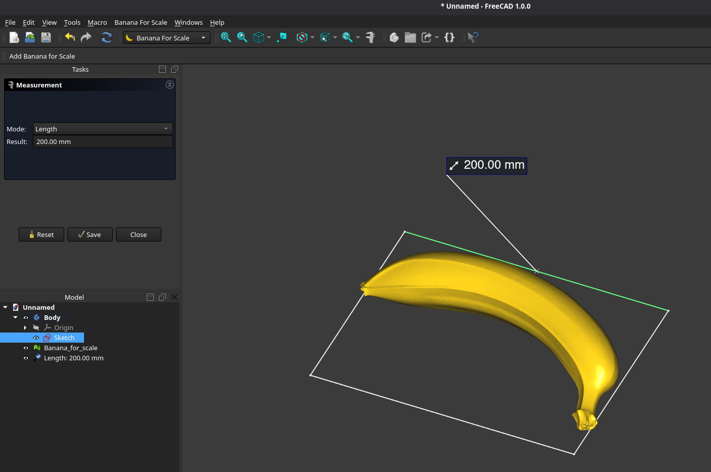

# BananaForScale

A FreeCAD addon that adds a banana for scale to your document.

## Installation

Install via the FreeCAD Addon Manager.

## Usage

Switch to the **Banana For Scale** workbench and click **Add Banana for Scale**.
The banana will be inserted and the transform tool will open so you can position it immediately.
